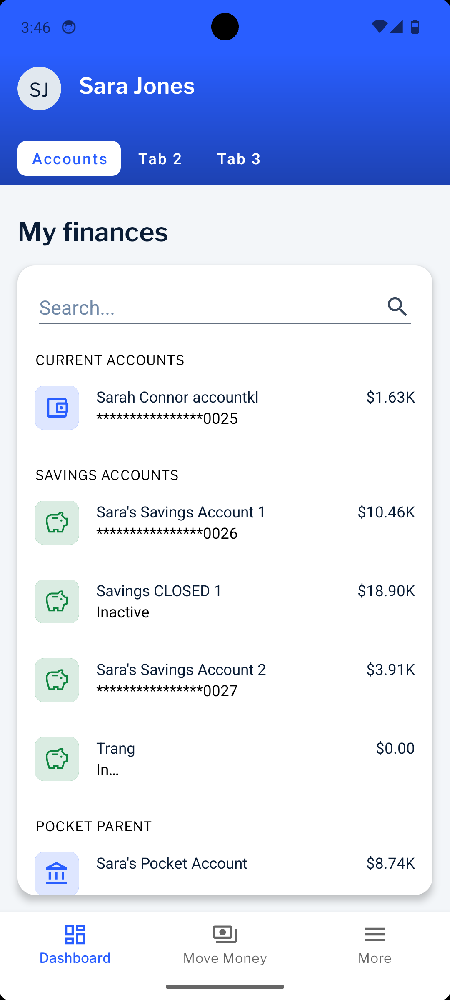

# Golden Sample Android App
This golden sample provides examples of the code structure, configuration, and best practices for using the Backbase Android tools.

## 💻 Getting started
To get started, please follow this [guide on Backbase.io](https://backbase.io/developers/documentation/mobile-devkit/getting-started/set-up-android-development/).

Note that this project connects to the EBP Sandbox Environment, for that you need to request an API key as [mentioned here](https://backbase.io/developers/documentation/api-sandbox/retail-banking-usa/android-guide/). Add the key to the `config.json` file in the assets folder.

## 🧬 Branch catalog
| Project |    |
|:-----|---------|
| `main` The minimal sample that includes all the required Backbase SDKs to get started to develop your own bank app. • Foundation libraries: MDS and MSDK • Identity Journey • Workspaces Journey • More Menu Journey • Example how to build a custom Accounts Journey • More Menu Journey • NEO header • Screenshot tests • Automated UI tests Status: `Maintained` EBP Sandbox 2023.09-LTS  [> Browse](https://github.com/Backbase/golden-sample-app-android) |   |
| | |
| `sample/devs/O11Y` An implementation of Backbase Observability that makes it easy to add 3rd party tracking libraries to your project. • Low complexity • Track screen views and user actions with Backbase Observability Status: `Maintained` EBP Sandbox 2023.09-LTS  [> Browse](https://github.com/Backbase/golden-sample-app-android/tree/sample/devs/O11Y) | |
| | |
| `sample/devs/open-telemetry` An implementation of Backbase OpenTelemetry Connector to track screen views and user actions. • Low complexity • Extension of Backbase Observability Status: `Maintained` EBP Sandbox 2023.09-LTS  [> Browse](https://github.com/Backbase/golden-sample-app-android/tree/sample/devs/open-telemetry) | |

## Contributing guide
Our contributing guide will tell you about our development process, how to propose bug fixes and improvements and how to build and test your changes to the Golden Sample App.

### Our development process
The Golden Sample App uses GitHub as its source of truth, serving as the central hub for the developer team’s collaboration. All changes will be public right from the start.

All pull requests will be checked by unit tests, integration tests, screenshot tests, style tests, and much more.

### Branch organization
Golden Sample App has one primary branch `main`. The `main` branch contains the minimum setup to get started with development and it will continuously be updated with the latest Backbase's LTS releases.
We use feature branches to deliver new POC and samples. They might not be maintained for the long run.

### Features
Additional features that are not included in the `main` branch can be found in separated branches. The description and the branch of the features can be found in the Branch catalog.

#### Branch naming
When creating a new feature, please follow this naming guideline: `type/valuestream/feature`

Type:
 - POC 
 - sample

Value stream: 
 - devs
 - retail
 - business

Example branch name: 
 - `poc/devs/O11Y`
 - `poc/retail/payments-journey`

## Issues
When opening a new issue, always make sure to fill out the issue template.
Please don’t use the GitHub issue tracker for questions. If you have questions about using the Golden Sample App, use any of our support channels and we will do our best to answer your questions.
